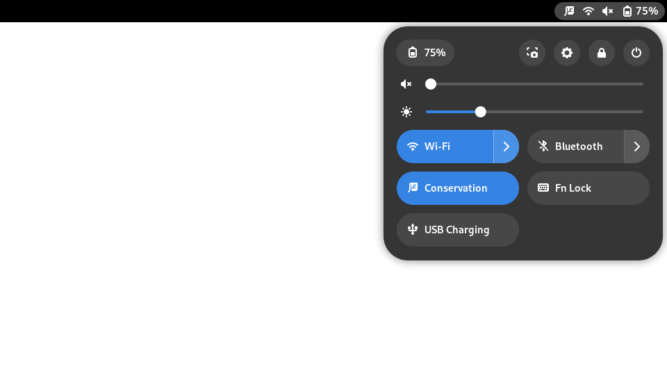

# Vantage Controls


### A GNOME Shell Extension

**Vantage Controls** is a GNOME Shell extension inspired by the Lenovo Vantage Toolbar on Windows. It provides users with seamless control over various system settings within the GNOME environment, blending these controls into GNOME's design.

---

## Features

- Control key Lenovo settings such as:
    - Conservation Mode
    - USB Charging
- Style blends naturally with GNOME Shell
- Lightweight, non-intrusive, and easy to use

---

## Installation

1. Clone the repository to your local machine:
    ```bash
    git clone https://github.com/oezturk/gnome-shell-extension-vantage-controls.git
    ```

2. Navigate to the directory:
    ```bash
    cd gnome-shell-extension-vantage-controls
    ```

3. Copy the extension to your GNOME Shell extensions folder:
    ```bash
    cp -r gnome-shell-extension-vantage-controls ~/.local/share/gnome-shell/extensions/vantage-controls@oezturk.github.io
    ```

4. Enable the extension using GNOME Tweaks or from the command line:
    ```bash
    gnome-extensions enable vantage-controls@oezturk.github.io
    ```

5. Restart GNOME Shell (press `Alt + F2`, then type `r` and press `Enter`) or log out and log back in.

---

## Screenshots



---

## Compatibility

- **GNOME Shell**: 43 or later
- **Tested on**: GNOME 43

---

## Contributing

Contributions are welcome! If you have suggestions, bug reports, or would like to contribute code, feel free to open an issue or submit a pull request.

---

## License

Vantage Controls is licensed under the **GNU General Public License v3.0**. See the [LICENSE](LICENSE) file for more information.

---

## Disclaimer

Vantage Controls is an **unofficial** project and is **not associated with Lenovo** in any way. It is inspired by the Lenovo Vantage Toolbar but operates independently within the GNOME environment.
